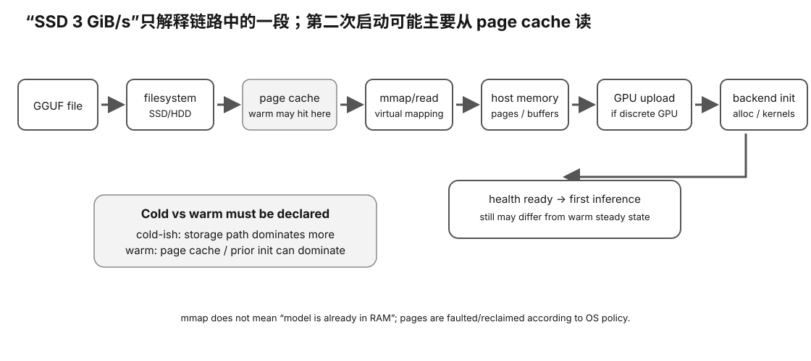

# Storage / Model Loading Card

<figure>
  
  <figcaption>视觉索引：先用图建立 Storage / Model Loading Card 的核心关系，再把下面的表格、公式与检查项作为快速查阅层。</figcaption>
</figure>


## Path

```
GGUF bytes
→ storage/filesystem
→ page cache
→ mmap/read/page faults
→ host buffers
→ device upload
→ ready
→ first inference
```

## Rough eager-read model

```
T_ready
≈
B_read / BW_source
+
T_host
+
B_upload / BW_upload
+
T_backend
```

Conceptual only.

## mmap

```
mapping
!=
all pages physically read immediately
```

Pages become resident according to access/runtime/OS behavior.

## Cache-state language

Prefer:

```
first measured pass — initial cache UNKNOWN
second pass after same-file read
```

Do not automatically call them cold/warm.

## Linux evidence

If available:

```
fincore
```

can report file-page residency.

It does not measure SSD controller cache or prove storage is the startup bottleneck.

## Never confuse

```
page-cache read rate
=
disk bandwidth
```

or:

```
SSD bandwidth
=
VRAM bandwidth
```

## Benchmark separately

- startup/readiness;
- first inference;
- steady PP;
- steady TG.

## Measurement warning

Reading/hashing the file changes page-cache state.
