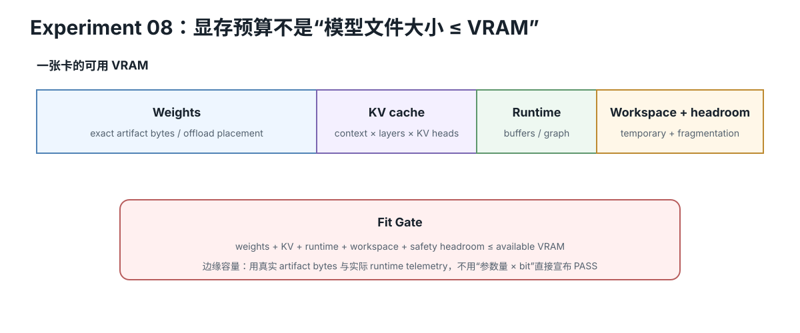

# 本地 LLM VRAM 预算速查：Weights + KV + Headroom

<figure>
  
  <figcaption>视觉索引：先用图建立 本地 LLM VRAM 预算速查：Weights + KV + Headroom 的核心关系，再把下面的表格、公式与检查项作为快速查阅层。</figcaption>
</figure>


## 最小预算式

```text
VRAM estimate
≈ weight payload
+ KV cache
+ runtime reserve
```

不要把它叫“精确显存需求”。

## 1. Weight baseline

```text
weight bytes
≈ parameter_count × effective_bits_per_weight / 8
```

### 7B 参数的纯 payload

| effective bpw | baseline |
|---:|---:|
| 16 | 13.04 GiB |
| 8 | 6.52 GiB |
| 4.5 | 3.67 GiB |
| 4 | 3.26 GiB |

为什么用 **effective bpw**：

真实 quant format 还有：
- scales
- zero-points
- metadata
- alignment
- mixed dtypes
- unquantized tensors

所以 nominal “4-bit” 不保证精确 4.000 bpw。

## 2. KV baseline

标准 decoder self-attention：

```text
K shape = [batch, kv_heads, seq_len, head_dim]
V shape = [batch, kv_heads, seq_len, head_dim]
```

每 layer：

```text
KV bytes
= 2
× batch
× seq_len
× kv_heads
× head_dim
× bytes_per_element
```

所有层：

```text
KV total
= 2
× layers
× active_sequences
× cached_tokens
× kv_heads
× head_dim
× bytes_per_element
```

每 sequence 每 token：

```text
KV bytes/token
= 2 × layers × kv_heads × head_dim × bytes_per_element
```

## 3. MHA / GQA / MQA

Hugging Face LlamaConfig 规则：

- kv_heads == attention_heads → MHA
- kv_heads == 1 → MQA
- otherwise → GQA

其他参数相同，KV memory 与 `kv_heads` 成正比。

### 抽象例：32 layers / head_dim 128 / FP16 KV

| attention | KV heads | KiB/token | 4096-token sequence |
|---|---:|---:|---:|
| MHA | 32 | 512 | 2 GiB |
| GQA | 8 | 128 | 512 MiB |
| MQA | 1 | 16 | 64 MiB |

## 4. Context 与 concurrency

普通 full-attention DynamicCache baseline：

```text
KV ∝ cached tokens × active sequences
```

context 4K → 8K：
KV 约 2×。

concurrency 1 → 4：
KV 约 4×。

两者一起增长：
相乘。

## 5. 一个 7B-like GQA preflight

抽象配置：

- 7B params
- effective 4.5 bpw
- 32 layers
- 8 KV heads
- head_dim 128
- FP16 KV
- 4096 cached tokens
- 1.5 GiB runtime reserve

结果：

```text
weights ≈ 3.667 GiB
KV / sequence = 0.500 GiB
```

| concurrency | KV | estimated total | 8 GiB headroom |
|---:|---:|---:|---:|
| 1 | 0.5 GiB | 5.167 GiB | 2.833 GiB |
| 2 | 1.0 | 5.667 | 2.333 |
| 4 | 2.0 | 6.667 | 1.333 |
| 8 | 4.0 | 8.667 | -0.667 |

> 上表若 reserve=1.5 GiB，total = weights + KV + reserve。

注意：如果你自己重算，请以 calculator 输出为准；实际 backend 还可能额外预留 KV pool、workspace、graph buffers。

## 6. 为什么 baseline 不等于 runtime

可能造成差异：

- Static cache preallocation
- paged KV block pool
- sliding-window / chunked attention
- KV quantization
- prefix cache reuse
- tensor/pipeline parallel sharding
- weight repacking
- activation/workspace
- allocator fragmentation
- CUDA/ROCm context
- desktop display memory
- offload

## 7. 读 config.json 先看什么

```text
num_hidden_layers
hidden_size
num_attention_heads
num_key_value_heads
head_dim
max_position_embeddings
sliding_window / layer_types / per-layer overrides
```

如果 `head_dim` 没写且架构遵循普通 LlamaConfig：

```text
head_dim = hidden_size / num_attention_heads
```

不要把这个 fallback 套给所有模型架构。

## 8. Safetensors metadata 能帮什么

不一定要先下载全部权重。

header 可以告诉你：
- tensor name
- dtype
- shape
- data offsets

可以据此：
- 数 parameter count
- 看 mixed dtype
- 估 payload size

## 9. Headroom rule

不要只输出：

```text
estimate < VRAM
```

至少再输出：

```text
headroom GiB
headroom %
```

课程建议：

- 大量正 headroom：才有资格进入真实加载测试；
- 小于约 10%：标成 **tight / unsafe assumption**，不要承诺 fit；
- negative：baseline 已超容量。

10% 只是课程 preflight warning threshold，不是 backend guarantee。

## 10. Offload

offload 能解决：

```text
GPU capacity shortage
```

但会制造新的：

```text
PCIe / interconnect / RAM / SSD bandwidth + latency cost
```

所以后面要把 capacity model 再接回 Roofline / interconnect。

## 一句话购卡顺序

```text
先看能不能放
→ 再看 bytes/token
→ 再看 bandwidth
→ 再看 compute
→ 最后用真实 backend benchmark 验证
```
